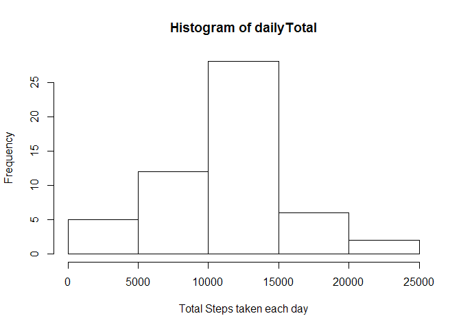
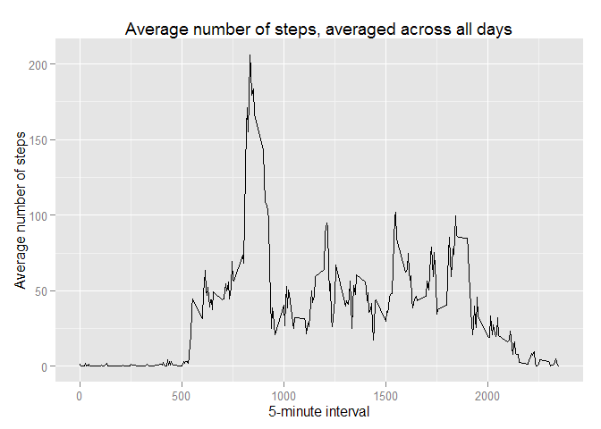
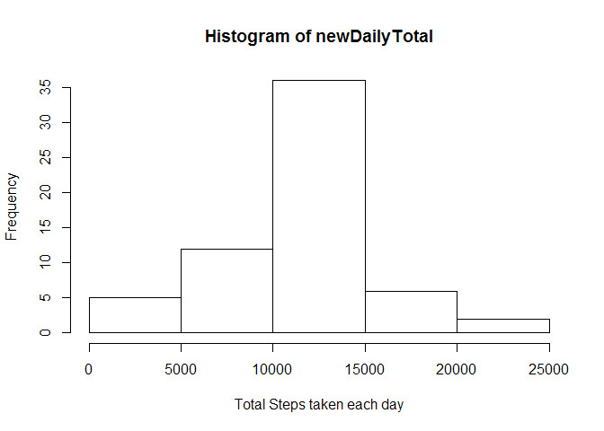
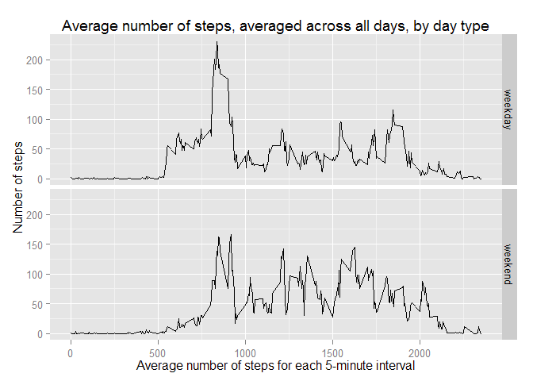

# Reproducible Research: Peer Assessment 1

Load required libraries and set options

```r
library(ggplot2)
options(scipen=999)
```

## Loading and preprocessing the data

1. Load the data

```r
setwd("~/GitHub/RepData_PeerAssessment1")
unzip(zipfile="activity.zip")
data <- read.csv("activity.csv", as.is=T)
```

2. Process/transform the data by removing NAs

```r
data1 <- na.omit(data)
```

## What is mean total number of steps taken per day?

1. Make a histogram of the total number of steps taken each day


```r
dailyTotal <- tapply(data1$steps,data1$date,FUN=sum,na.rm=T)
hist(dailyTotal,xlab="Total Steps taken each day")
```

 

2. Calculate and report the mean and median total number of steps taken per day

```r
mean(dailyTotal)
```

```
## [1] 10766
```

```r
median(dailyTotal)
```

```
## [1] 10765
```

The mean daily total number of steps is 10766.1887, the median daily total number of steps is 10765

## What is the average daily activity pattern?

1.Make a time series plot of the 5-minute interval and the average number of steps taken, averaged across all days 
  a.Prepare data for plotting

```r
averageSteps <- aggregate(x=list(steps=data1$steps),by=list(interval=data1$interval), FUN=mean,na.rm=T)
```

  b.Plot average number of steps, averaged across all days

```r
ggplot(data=averageSteps,aes(x=interval,y=steps))+
geom_line()+
xlab("5-minute interval")+
ylab("Average number of steps")+
ggtitle("Average number of steps, averaged across all days")
```

 

2. Which 5-minute interval, on average across all the days in the dataset, contains the maximum number of steps


```r
max_steps <- which.max(averageSteps$steps)
interval <- averageSteps[max_steps,]$interval
```

The 835 interval has the maximum number of steps.

## Imputing missing values

1. Calculate number of missing values in dataset 

```r
incomplete <- data[!complete.cases(data),]

nrow(incomplete)
```

```
## [1] 2304
```
There are 2304 rows with missing values

2. Devise strategy for filling in all of the missing values in the dataset.

Strategy is to use the interval average, averaged across days

```r
imputeValue <- function(steps,interval) {
  out <- NA
  if(!is.na(steps))
      out <- c(steps)
  else
      out <- averageSteps[averageSteps$interval==interval,"steps"]
  return(out)
}
```

3. Create an new dataset that is equal to original dataset but with missing data filled in

```r
 data2 <- data
 data2$steps <- mapply(imputeValue,data2$steps,data2$interval)
```

4. Make histogram of the total number of steps, calculate and report mean and median total number of steps per day.  


```r
newDailyTotal <- tapply(data2$steps,data2$date,FUN=sum,na.rm=T)
hist(newDailyTotal,xlab="Total Steps taken each day")
```

 

```r
mean(newDailyTotal)
```

```
## [1] 10766
```

```r
median(newDailyTotal)
```

```
## [1] 10766
```

The mean daily total number of steps is 10766.1887, the median daily total number of steps is 10766.1887

The imputation of missing values did not change the mean but changed the median slightly. 

## Are there differences in activity patterns between weekdays and weekends?

1. Create a new factor varialbes in the dataset with two levels - "weekday" and "weekend" indicating whether a given date is a weekday or weekend day. 

  a. Convert date in dataframe to Date type.

```r
data2$date <- as.Date(data2$date,"%Y-%m-%d")
```
  b. Use weekdays function to determine day of the week for each date 

```r
data2$day <- weekdays(data2$date)
```
  c. Determine if day is weekday or weekend, add this to dayType column in dataframe

```r
data2$dayType <- c("Unknown")

for(i in 1:nrow(data2)){
  if(data2$day[i] %in% c("Saturday","Sunday"))
    data2$dayType[i] <- "weekend"
  else
    data2$dayType[i] <- "weekday"
}
```

2. Make a panel plot containing a time series plot of the 5-minute interval and average number of steps taken, averaged across all weekday days or weekend days.

a. Aggregate data


```r
averageSteps2 <- aggregate(steps ~ interval + dayType, data=data2, FUN=mean)
```
b. Plot panel plot 


```r
ggplot(averageSteps2,aes(interval,steps))+
geom_line()+
facet_grid(dayType ~.)+
xlab("Average number of steps for each 5-minute interval")+
ylab("Number of steps")+
ggtitle("Average number of steps, averaged across all days, by day type")
```

 
